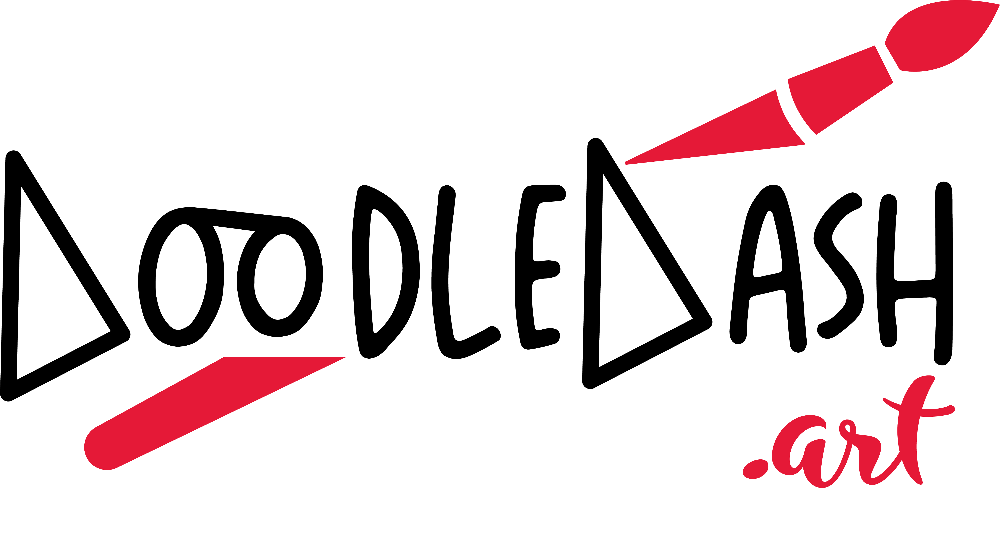

  

# Doodledash

DoodleDash is a community-generated NFT platform. The idea behind DoodleDash is to allow anyone to participate in creating community-generated NFTs.

The front-end for this project was bootstrapped with [Create React App](https://github.com/facebook/create-react-app).

## About the project

The core aspect of the Doodledash UI revolves around the canvas which allows users to draw from any device and any browser. This project uses EaselJS to easily write and update the canvas data and uses websockets to update the canvas from live data from other active participants, allowing users to collaborate in real time.

The core functionality of the canvas is written in the `canvas.manager.js` file.

## How to run the project

In the project directory, you can run:

### `npm start`

Runs the app in the development mode.\
Open [http://localhost:3000](http://localhost:3000) to view it in your browser.

The page will reload when you make changes.\
You may also see any lint errors in the console.

### `npm run build`

Builds the app for production to the `build` folder.\
It correctly bundles React in production mode and optimizes the build for the best performance.

The build is minified and the filenames include the hashes.\
Your app is ready to be deployed!

See the section about [deployment](https://facebook.github.io/create-react-app/docs/deployment) for more information.

## Learn More

Access the live production website for Doodledash [here](https://www.doodledash.art).

Learn more in the [Create React App documentation](https://facebook.github.io/create-react-app/docs/getting-started).

Learn more about [EaselJS](https://www.createjs.com/easeljs)

Learn more about [Socker.io](https://socket.io/)

## Deployment

Merge to master deploys the website though GitHub Actions using Firebase.
